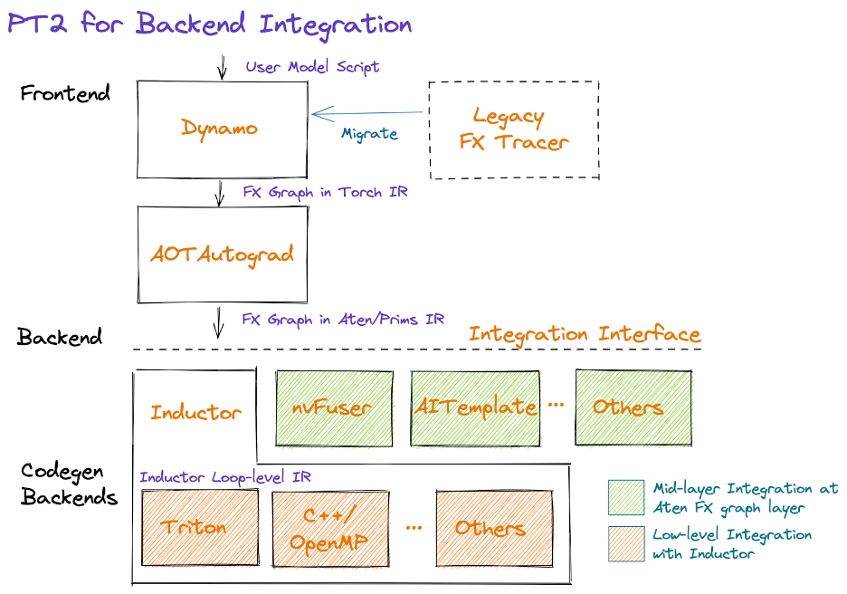
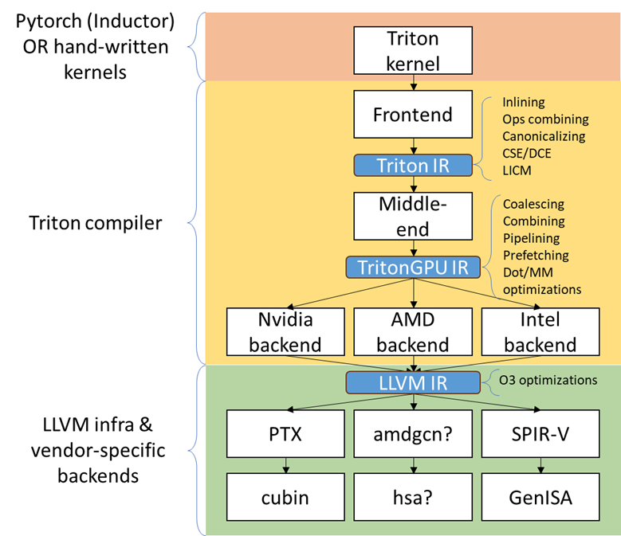
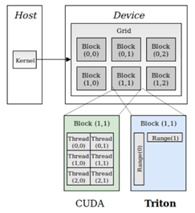
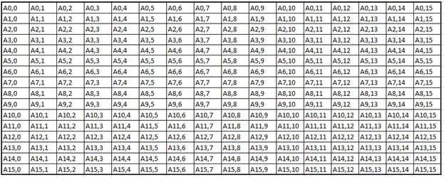
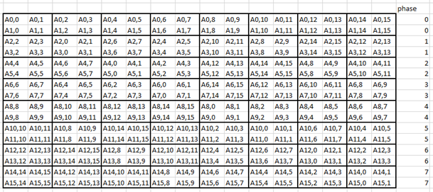
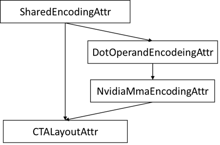

# Triton architecture

The goal of this document is to describe the high-level architecture and roadmap of the solution outlining components and interactions. The intended audience is triton & triton backend developers. No a priori knowledge is assumed, however, the introduction is concise (use links to familiarize yourself with the basics as necessary).

## Introduction

Triton [1][10] has two main use cases: triton language JIT compiler and pytorch 2.0 [2] low-level backend compiler. Here we focus on the latter but keep the former in mind (as well as supporting other frameworks).



From pytorch point of view, a model FX graph [3] is captured by Dynamo [4] (and AOT Autograd if necessary) which is passed to Inductor [5]. The Inductor converts the broad set of pytorch’s ATen operators into a narrower set of stable primitive operators (PrimTorch) [6] via “decompositions” (a customizable mechanism for complex operator expansion). The resulting graph is translated into Triton kernels which are decorated python functions produced by the Inductor [7]. Triton frontend consumes function sources, the internals follow traditional compiler architecture: an AST is built and traversed to produce an MLIR module. The module is progressively lowered into the LLVM dialect. A regular LLVM module is then produced and converted to an appropriate representation depending on the target (e.g., PTX for Nvidia). A compiled kernel is then returned with a launcher stub. Kernels are then executed by pytorch through Inductor’s scheduling & wrapper interfaces.

## Triton MLIR compiler details

### Code generation overview

The Triton structure can be broken down into three major parts, following the classical compiler structure:
1. The frontend consumes a decorated Python kernel and transforms it into Triton IR (MLIR Triton dialect).
2. The middle-end consumes the IR and progressively lowers it to the TritonGPU dialect applying optimizations.
3. The backend lowers TritonGPU dialect to LLVM dialect, then converts it to LLVM IR and an appropriate format depending on the target (e.g., ptx/cubin in Nvidia case).
There are three main IR stages on which most of the optimizations are done: Triton dialect, TritonGPU dialect [8], and LLVM IR. Note: Vendor-specific backends introduce additional dialects (e.g., GenX for Intel) to help with TritonGPU lowering.



In addition to the custom dialects Triton reuses upstream ones like arith & math for math, scf/cf for control flow, index, func, nvvm for low-level GPU operations. Triton also introduces some Nvidia-specific dialects for lowering to Hopper target.

#### Torch Inductor IR (input language)
Torch Inductor is a pure Python compiler of pytorch models. The Inductor uses “define-by-run” loop level IR. It supports dynamic shapes/strides. The Inductor primarily targets GPUs with Triton and CPUs by generating C++ sources with OpenMP. At a high-level Inductor  performs:
* **Graph operators’ decomposition** into a smaller set of operators (~250 PrimTorch ops instead of ~2k pytorch ops [11]; Note: the sets are not stabilized!).
* **Loop-level IR graph lowering**: remove views, broadcasting, indexing simplification, materialization vs reuse decisions, layout optimization, loop reordering.
* **Scheduling**: horizontal/vertical/reduction fusion , tiling, memory planning, buffer reuse, autotuning.
* **Backend code generation** (depending on the target).
* **Wrapper code generation**: basically, an unrolled interpreter loop to run the generated kernel (gather the inputs, symbolic shape processing, allocate the tensors, and invoke the kernel).
The sequence of the above steps produces a `call` function that controls the guards [13] and then calls a sequence of Aten/Extern kernels intermixed with generated triton functions. Former are resolved through an algorithm selection mechanism [12]. The latter is a Python function with `@triton.jit` decorator, e.g. (fused bias from a linear layer and a Relu):

```python
@triton.jit
def triton_(in_out_ptr0, in_ptr0, xnumel, XBLOCK : tl.constexpr):
    xnumel = 16
    xoffset = tl.program_id(0) * XBLOCK
    xindex = xoffset + tl.arange(0, XBLOCK)[:]
    xmask = xindex < xnumel
    x0 = xindex % 8
    x2 = xindex
    tmp0 = tl.load(in_ptr0 + (x0), xmask, eviction_policy='evict_last')
    tmp1 = tl.load(in_out_ptr0 + (x2), xmask)
    tmp2 = tmp0 + tmp1
    tmp3 = triton_helpers.maximum(0, tmp2)
    tl.store(in_out_ptr0 + (x2), tmp3, xmask)
```

Each kernel will additionally be annotated with meta information such as size hints, signature, device type, mutated args, and others.
By default, Inductor reuses efficient implementations of compute-heavy operations such as matrix multiplication or flash attention via dispatching a call to the Aten op native implementation. The generated code for a single causal attention block would look like the following. Note the linear layers and the attention blocks produce a standalone kernel call (only the fused native dropout makes it to a Triton kernel in this case).

```python
def call(args):
    primals_1, primals_2, primals_3 = args
    args.clear()
    assert_size_stride(primals_1, (1536, 512), (512, 1))
    assert_size_stride(primals_2, (512, 512), (512, 1))
    assert_size_stride(primals_3, (1, 128, 512), (65536, 512, 1))
    with torch.cuda._DeviceGuard(0):
        torch.cuda.set_device(0) # no-op to ensure context
        buf0 = empty_strided((128, 1536), (1536, 1), device='cuda', dtype=torch.float16)
        # Source Nodes: [l__self___c_attn], Original ATen: [aten.mm]
        extern_kernels.mm(reinterpret_tensor(primals_3, (128, 512), (512, 1), 0), reinterpret_tensor(primals_1, (512, 1536), (1, 512), 0), out=buf0)
        del primals_1
        # Source Nodes: [scaled_dot_product_attention], Original ATen: [aten._scaled_dot_product_flash_attention]
        buf1 = aten._scaled_dot_product_flash_attention(reinterpret_tensor(buf0, (1, 8, 128, 64), (0, 64, 1536, 1), 0), reinterpret_tensor(buf0, (1, 8, 128, 64), (0, 64, 1536, 1), 512), reinterpret_tensor(buf0, (1, 8, 128, 64), (0, 64, 1536, 1), 1024), 0.1, True)
        buf2 = buf1[0]
        assert_size_stride(buf2, (1, 8, 128, 64), (65536, 64, 512, 1))
        buf3 = buf1[1]
        assert_size_stride(buf3, (1, 8, 128), (1024, 128, 1))
        buf4 = buf1[2]
        assert_size_stride(buf4, (2, ), (1, ))
        buf5 = buf1[3]
        assert_size_stride(buf5, (2, ), (1, ))
        buf6 = buf1[6]
        assert_size_stride(buf6, (), ())
        buf7 = buf1[7]
        assert_size_stride(buf7, (), ())
        del buf1
        buf9 = empty_strided((128, 512), (512, 1), device='cuda', dtype=torch.float16)
        # Source Nodes: [l__self___c_proj], Original ATen: [aten.mm]
        extern_kernels.mm(reinterpret_tensor(buf2, (128, 512), (512, 1), 0), reinterpret_tensor(primals_2, (512, 512), (1, 512), 0), out=buf9)
        buf10 = empty_strided((1, ), (1, ), device='cuda', dtype=torch.int64)
        # Source Nodes: [], Original ATen: []
        aten.randint.low_out(-9223372036854775808, 9223372036854775807, [1], out=buf10)
        buf12 = empty_strided((1, 128, 512), (65536, 512, 1), device='cuda', dtype=torch.bool)
        buf13 = reinterpret_tensor(buf9, (1, 128, 512), (65536, 512, 1)); del buf9  # reuse
        # Source Nodes: [l__self___resid_dropout], Original ATen: [aten.native_dropout]
        stream0 = get_cuda_stream(0)
        triton_poi_fused_native_dropout_0.run(buf13, buf10, buf12, 0, 65536, grid=grid(65536), stream=stream0)
        return (buf13, reinterpret_tensor(primals_3, (128, 512), (512, 1), 0), reinterpret_tensor(buf0, (1, 8, 128, 64), (0, 64, 1536, 1), 0), reinterpret_tensor(buf0, (1, 8, 128, 64), (0, 64, 1536, 1), 512), reinterpret_tensor(buf0, (1, 8, 128, 64), (0, 64, 1536, 1), 1024), buf2, buf3, buf4, buf5, buf6, buf7, reinterpret_tensor(buf2, (128, 512), (512, 1), 0), buf12, reinterpret_tensor(primals_2, (512, 512), (512, 1), 0), )
```

It is worth noting that Inductor can replace these native aten implementations with triton templated kernels.
Inductor then passes the generated kernels (Triton source code) to the Triton compiler.

#### Triton frontend
Triton frontend is responsible for converting the input python-like language to the intermediate representation (Triton MLIR dialect). Consider an example kernel for softmax calculation.

```python
@triton.jit
def softmax_kernel(output_ptr, input_ptr, input_row_stride, output_row_stride, n_cols, BLOCK_SIZE: tl.constexpr):
    row_idx = tl.program_id(0)
    row_start_ptr = input_ptr + row_idx * input_row_stride
    col_offsets = tl.arange(0, BLOCK_SIZE)
    input_ptrs = row_start_ptr + col_offsets
    row = tl.load(input_ptrs, mask=col_offsets < n_cols, other=-float('inf'))
    row_minus_max = row - tl.max(row, axis=0)
    numerator = tl.exp(row_minus_max)
    denominator = tl.sum(numerator, axis=0)
    softmax_output = numerator / denominator
    output_row_start_ptr = output_ptr + row_idx * output_row_stride
    output_ptrs = output_row_start_ptr + col_offsets
    tl.store(output_ptrs, softmax_output, mask=col_offsets< n_cols)
```

The resulting IR follows the input language almost 1 to 1:
```s
  tt.func public @softmax_kernel_0d1d234(%arg0: !tt.ptr<f32> {tt.divisibility = 16 : i32}, %arg1: !tt.ptr<f32> {tt.divisibility = 16 : i32}, %arg2: i32, %arg3: i32, %arg4: i32) attributes {noinline = false} {
    %0 = tt.get_program_id x : i32
    %1 = arith.muli %0, %arg2 : i32
    %2 = tt.addptr %arg1, %1 : !tt.ptr<f32>, i32
    %3 = tt.make_range {end = 1024 : i32, start = 0 : i32} : tensor<1024xi32>
    %4 = tt.splat %2 : (!tt.ptr<f32>) -> tensor<1024x!tt.ptr<f32>>
    %5 = tt.addptr %4, %3 : tensor<1024x!tt.ptr<f32>>, tensor<1024xi32>
    %6 = tt.splat %arg4 : (i32) -> tensor<1024xi32>
    %7 = arith.cmpi slt, %3, %6 : tensor<1024xi32>
    %cst = arith.constant 0xFF800000 : f32
    %cst_0 = arith.constant dense<0xFF800000> : tensor<1024xf32>
    %8 = tt.load %5, %7, %cst_0 {cache = 1 : i32, evict = 1 : i32, isVolatile = false} : tensor<1024xf32>
    %9 = tt.call @max__fp32S1024S__1cconstexpr_0__2cconstexpr_False__3cconstexpr_True_(%8) : (tensor<1024xf32>) -> f32
    %10 = tt.splat %9 : (f32) -> tensor<1024xf32>
    %11 = arith.subf %8, %10 : tensor<1024xf32>
    %12 = math.exp %11 : tensor<1024xf32>
    %13 = tt.call @sum__fp32S1024S__1cconstexpr_0_(%12) : (tensor<1024xf32>) -> f32
    %14 = tt.splat %13 : (f32) -> tensor<1024xf32>
    %15 = arith.divf %12, %14 : tensor<1024xf32>
    %16 = arith.muli %0, %arg3 : i32
    %17 = tt.addptr %arg0, %16 : !tt.ptr<f32>, i32
    %18 = tt.splat %17 : (!tt.ptr<f32>) -> tensor<1024x!tt.ptr<f32>>
    %19 = tt.addptr %18, %3 : tensor<1024x!tt.ptr<f32>>, tensor<1024xi32>
    %20 = tt.splat %arg4 : (i32) -> tensor<1024xi32>
    %21 = arith.cmpi slt, %3, %20 : tensor<1024xi32>
    tt.store %19, %15, %21 {cache = 1 : i32, evict = 1 : i32} : tensor<1024xf32>
    tt.return
  }
```



As seen in the example above, Triton relies on pointer arithmetic mixed with a wide set of ‘built  -ins’ (e.g., `tl.program_id()`) calls to produce the IR. There is tensor creation, shape manipulation, math, memory, and some other built-ins available (see [16] for the complete set). The program model (SPMD) assumes that an executor runs a number of ‘programs’ that process different data. The kernel can accept torch tensors and treat them as a tensor of pointers. Each kernel is assumed to be single-threaded, each working on a ‘block’ of data (e.g., `BLOCK_SIZE: tl.constexpr` in the kernel example above; in this case happens to equal 1024). Triton “automatically” parallelizes the execution across the range of data. Since the block size affects hardware mapping (e.g., shared memory access) the value is a compile-time constant. Automatic parallelization basically means that users do not need to explicitly control and synchronize (e.g., for shared memory access). Calls to math functions are emitted as additional functions usually containing libdevice calls (or similar).
Additionally, Triton provides a runtime and a JIT, and caches previously compiled kernels for reuse. Python binding is done through pybind11 [24].
The resulting IR is passed to the optimizer (middle-end).

### Triton optimizations
Triton’s optimizer uses custom MLIR and default LLVM optimization passes to improve kernel performance. Passes are primarily run over Triton dialect, TritonGPU dialect, and LLVM IR. There’re some common passes like inline, LICM, CSE, DSE that are run at each stage as well as dialect specific optimizations that are described below.

#### Triton dialect
Triton dialect [17] closely mimics the language built-ins exposed to the user. Its input types are basic types like floating point of different formats, pointers, and tensors of basic types. The operations are: tensor creation and shape manipulation, tensor pointer arithmetic, SPMD primitives, loads/stores, reductions, scans, atomics, debug ops, and some others (e.g., some weird like a modified func.call op).
At this level the optimizer runs:
* Combine pass – applying rewrite rules for IR simplification.
* Broadcast reordering.
* Tensor pointer rewriting.

#### TritonGPU dialect
TritonGPU dialect [18] exposes GPU-specific operators. After converting Trition dialect to TritonGPU the following set of optimizations are run:
* Coalescing – make sure the dimension with greatest contiguity is first.
* Layout conversion removal.
* Thread locality optimization.
* Matmul acceleration pipeline.
* Dot operands optimization.
* SW Pipelining.
* Prefetching – add hoisted multi-buffering in the shared memory for the dot operator inside a loop.
* Data duplication reduction.
* Instruction reordering.

The most important thing about the dialect is that it changes how tensors are represented by adding a layout. The layout attribute determines how the data should be partitioned across GPU threads. There are two classes of layouts: shared and distributed.

##### Shared layout class
This layout is used for tensors that can be accessed within shared memory by different GPU threads. The layout describes elements swizzling to avoid shared memory access bank conflicts. The main purpose of the layout is to, as the name suggests, shared memory mapping.
Example:
```
A_{0, 0}  A_{0, 1}  A_{0, 2}  A_{0, 3} ...   [phase 0] \ per_phase = 2
A_{1, 0}  A_{1, 1}  A_{1, 2}  A_{1, 3} ...   [phase 0] /
groups of vec=2 elements
are stored contiguously
_ _ _ _ /\_ _ _ _
A_{2, 2}  A_{2, 3}  A_{2, 0}  A_{2, 1} ...   [phase 1] \ per phase = 2
A_{3, 2}  A_{3, 3}  A_{3, 0}  A_{3, 1} ...   [phase 1] /
```

An actual shared layout is described by the following parameters:
* Swizzling parameters. These control swizzling patterns (phase)
    * **Vec** – represents the number of elements in a “package” to be swizzled.
    * Multiple consecutive rows can have the same swizzling pattern. The number of rows that have the same swizzling pattern is **perPhase**. Calculated based on the parent MMFA/MMA encoding.
    * **maxPhase** – represents the total number of patterns. This is usually set according to how shared memory is accessed to minimize bank conflicts.
* **Order** – an array, fastest changing axis first
* **CTA Layout** – containing CTAs (groups) per CGA (grid), CTASplitNum, and CTAOrder.
* **hasLeadingOffset** – Boolean value when set to true means when matrix is stored shared memory, there will be an offset not only in the stride dimension, but also in the leading dimension. For example, a matrix of size 16x128 and data type I8 is stored in the shared memory with 64B-swizzle mode. The offset of the element with index (0, 64) will be 16*64, compared to 1*64 when the hasLeadingOffset is false.
Example [20]. Assume 16 (M) by 16 (N) tensor A and each element is a f32. And we want to do swizzling along the N dim (row).



The swizzling is done for volta, so perPhase = 128 / (elementsPerRow * elementTypeInBytes) = 128 / (16*4) = 2. In this toy example, without assuming any access pattern, we can set maxPhase to 8, so that we have enough swizzling patterns to cover all the 16 rows. Let's assume vec = 2 as the value is decided by the user of the shared memory. Swizzling function is the xor function: col_swizzled = (col / vec) ^ phase * vec.
The data layout in shared memory becomes:



The solid line unites tensor elements that are processed by a single thread.

##### Distributed layout class

The Distributed encoding describes the layout tensor L with the 4-level hierarchy of multiple threads on GPU. It is abstracted from the top to the bottom as Groups Per Grid->Subgroups per Group->Threads Per Subgroup->Values Per Thread. For Groups (CTA) Per Grid (CGA) and Subgroups (Warps) Per Group (CTA) level, the linear id is distributed contiguously with the shape and order.
For example, a shape/order pair defines a distribution layout:
```
shape = [4, 4]
order = [0, 1] // The fastest-changing axis first
->
layout = [0  4  8  12]
         [1  5  9  13]
         [2  6  10 14]
         [3  7  11 15]
```

For the Threads Per Subgroup (Warp) and Values Per Thread level, the linear id distribution is variant for each sub-class encoding.
The layout function L of this layout is then defined, for an index i∈R^D , as follows:
L(A)[i_d ]=L[i_d+k_d*A.shape[d]]  % L.shape[d]  for ∀k_d  such as i_d+k_d*A.shape[d]<L.shape[d]

The two presented classes form additional layout encodings.

##### Blocked layout
The blocked layout is a distributed layout where each subgroup (warp) owns a contiguous portion of the target tensor. This is typically the kind of data layout used to promote memory coalescing in LoadInst and StoreInst. It is characterized by three tuples – thread tile size, subgroup (warp) tile size, and block tile size – which specify the number of elements owned by each GPU thread, subgroup, and group respectively. The purpose of the blocked layout is to describe the register file mapping.
The actual parameter set is the following:
* **sizePerThread** – defines the thread tile size, e.g., a tuple {2, 2} would mean each thread owns a 2 by 2 square matrix of elements.
* **threadsPerWarp** – defines the subgroup or warp tile size. Since a subgroup size has very limited options this would look like e.g. {8, 4} for SIMD32. The example would mean that each subgroup will process a set of 8 elements in 4 rows (and the assignment to the thread is determined by sizePerThread).
* **warpsPerCTA** – defines how a tensor is split between the subgroups that build up a group. E.g., a {2, 1} would mean a “horizontal” tensor partitioning and {1, 2} – “vertical”.
* **Order** – an array, fastest changing axis first
* **CTA Layout** – containing CTAs (groups) per CGA (grid), CTASplitNum, and CTAOrder.
Todo: example of non-contiguous access.
Following are a couple of examples from Triton’s inline doc (numbers mean thread ID, positions mean elements in a tensor):
Example 1, a row-major coalesced layout may partition a 16x16 tensor over 2 warps (i.e. 64 threads) as follows:
```
[ 0  0  1  1  2  2  3  3  ; 32 32 33 33 34 34 35 35 ]
[ 0  0  1  1  2  2  3  3  ; 32 32 33 33 34 34 35 35 ]
[ 4  4  5  5  6  6  7  7  ; 36 36 37 37 38 38 39 39 ]
[ 4  4  5  5  6  6  7  7  ; 36 36 37 37 38 38 39 39 ]
...
[ 28 28 29 29 30 30 31 31 ; 60 60 61 61 62 62 63 63 ]
[ 28 28 29 29 30 30 31 31 ; 60 60 61 61 62 62 63 63 ]
```
for
```
#triton_gpu.blocked_layout<{
  sizePerThread = {2, 2}
  threadsPerWarp = {8, 4}
  warpsPerCTA = {1, 2}
  CTAsPerCGA = {1, 1}
}>
```

Example 2, a row-major coalesced layout may partition a 32x32 tensor over 2 warps (i.e. 64 threads) as follows:
```
[ 0  0  1  1  2  2  3  3  ; 32 32 33 33 34 34 35 35  0  0  1  1  2  2  3  3  ; 32 32 33 33 34 34 35 35 ]
[ 0  0  1  1  2  2  3  3  ; 32 32 33 33 34 34 35 35  0  0  1  1  2  2  3  3  ; 32 32 33 33 34 34 35 35 ]
[ 4  4  5  5  6  6  7  7  ; 36 36 37 37 38 38 39 39  4  4  5  5  6  6  7  7  ; 36 36 37 37 38 38 39 39 ]
[ 4  4  5  5  6  6  7  7  ; 36 36 37 37 38 38 39 39  4  4  5  5  6  6  7  7  ; 36 36 37 37 38 38 39 39 ]
...                                                 ...
[ 28 28 29 29 30 30 31 31 ; 60 60 61 61 62 62 63 63  28 28 29 29 30 30 31 31 ; 60 60 61 61 62 62 63 63 ]
[ 28 28 29 29 30 30 31 31 ; 60 60 61 61 62 62 63 63  28 28 29 29 30 30 31 31 ; 60 60 61 61 62 62 63 63 ]
[ 0  0  1  1  2  2  3  3  ; 32 32 33 33 34 34 35 35  0  0  1  1  2  2  3  3  ; 32 32 33 33 34 34 35 35 ]
[ 0  0  1  1  2  2  3  3  ; 32 32 33 33 34 34 35 35  0  0  1  1  2  2  3  3  ; 32 32 33 33 34 34 35 35 ]
[ 4  4  5  5  6  6  7  7  ; 36 36 37 37 38 38 39 39  4  4  5  5  6  6  7  7  ; 36 36 37 37 38 38 39 39 ]
[ 4  4  5  5  6  6  7  7  ; 36 36 37 37 38 38 39 39  4  4  5  5  6  6  7  7  ; 36 36 37 37 38 38 39 39 ]
...                                                 ...
[ 28 28 29 29 30 30 31 31 ; 60 60 61 61 62 62 63 63  28 28 29 29 30 30 31 31 ; 60 60 61 61 62 62 63 63 ]
[ 28 28 29 29 30 30 31 31 ; 60 60 61 61 62 62 63 63  28 28 29 29 30 30 31 31 ; 60 60 61 61 62 62 63 63 ]
```
for
```
#triton_gpu.blocked_layout<{
  sizePerThread = {2, 2}
  threadsPerWarp = {8, 4}
  warpsPerCTA = {1, 2}
  CTAsPerCGA = {1, 1}
}>
```

Example 3, A row-major coalesced layout may partition a 32x32 tensor over 2 warps (i.e. 64 threads) and
4 CTAs (taking 2x2 for example) as follows:

```
CTA [0,0]                                              CTA [0,1]
[ 0  0  1  1  2  2  3  3  ; 32 32 33 33 34 34 35 35 ]  [ 0  0  1  1  2  2  3  3  ; 32 32 33 33 34 34 35 35 ]
[ 0  0  1  1  2  2  3  3  ; 32 32 33 33 34 34 35 35 ]  [ 0  0  1  1  2  2  3  3  ; 32 32 33 33 34 34 35 35 ]
[ 4  4  5  5  6  6  7  7  ; 36 36 37 37 38 38 39 39 ]  [ 4  4  5  5  6  6  7  7  ; 36 36 37 37 38 38 39 39 ]
[ 4  4  5  5  6  6  7  7  ; 36 36 37 37 38 38 39 39 ]  [ 4  4  5  5  6  6  7  7  ; 36 36 37 37 38 38 39 39 ]
...                                                    ...
[ 28 28 29 29 30 30 31 31 ; 60 60 61 61 62 62 63 63 ]  [ 28 28 29 29 30 30 31 31 ; 60 60 61 61 62 62 63 63 ]
[ 28 28 29 29 30 30 31 31 ; 60 60 61 61 62 62 63 63 ]  [ 28 28 29 29 30 30 31 31 ; 60 60 61 61 62 62 63 63 ]

CTA [1,0]                                              CTA [1,1]
[ 0  0  1  1  2  2  3  3  ; 32 32 33 33 34 34 35 35 ]  [ 0  0  1  1  2  2  3  3  ; 32 32 33 33 34 34 35 35 ]
[ 0  0  1  1  2  2  3  3  ; 32 32 33 33 34 34 35 35 ]  [ 0  0  1  1  2  2  3  3  ; 32 32 33 33 34 34 35 35 ]
[ 4  4  5  5  6  6  7  7  ; 36 36 37 37 38 38 39 39 ]  [ 4  4  5  5  6  6  7  7  ; 36 36 37 37 38 38 39 39 ]
[ 4  4  5  5  6  6  7  7  ; 36 36 37 37 38 38 39 39 ]  [ 4  4  5  5  6  6  7  7  ; 36 36 37 37 38 38 39 39 ]
...                                                    ...
[ 28 28 29 29 30 30 31 31 ; 60 60 61 61 62 62 63 63 ]  [ 28 28 29 29 30 30 31 31 ; 60 60 61 61 62 62 63 63 ]
[ 28 28 29 29 30 30 31 31 ; 60 60 61 61 62 62 63 63 ]  [ 28 28 29 29 30 30 31 31 ; 60 60 61 61 62 62 63 63 ]
```
for
```
#triton_gpu.blocked_layout<{
  sizePerThread = {2, 2}
  threadsPerWarp = {8, 4}
  warpsPerCTA = {1, 2}
  CTAsPerCGA = {2, 2}
}>
```

The last piece of the puzzle for dot operator lowering (see Dot product optimization & layout lowering) is the matrix multiplication input (dot) and output (mma) operands layouts.

##### Dot operand layout
In the TritonGPU dialect, considering d = tt.dot a, b, c. tt.dot's operands a and b must be of DotOperandEncodingAttr distributed layout.

##### MMA layout
MMA layouts provide the register file mapping for the result of a matrix multiplication instruction. There are different layouts for different hardware (e.g., MFMA for AMD, NvidiaMma for Nvidia, DPAS for Intel). See Nvidia’s examples at [26].

### Dot product optimization & layout lowering
GPUs provide specific instructions for efficient matrix multiplication (Nvidia’s MMA [21], Intel’s DPAS [22], and AMD’s MFMA [23]). These are usually implemented as systolic arrays and produce/consume a tile of input and output values (as opposed to regular instructions consuming 1 operand at a time). The performance of workloads using these instructions is highly dependent on data throughput, thus the overall flow looks like the following:
* Load input operand tiles from the global device memory into the shared memory. These tiles will have a _shared_ layout.
* Load a small portion of the data to the register file. These will have a _dot_ layout.
* Execute the MM instruction. The result of the instruction is written back to the register file and will have a _mma_ (or similar) layout.
Layouts dependency example (an arrow from Dot layout to MMA layout means MMA is a parent of Dot layout):



A single dot operator is likely to be mapped to multiple MMA instructions. For Nvidia flow, these will be emitted as inline assembly into LLVM (e.g., `llvm.inline_asm has_side_effects asm_dialect = att operand_attrs = [] "mma.sync.aligned.m16n8k16.row.col.f32.f16.f16.f32 …`).

### Layout conversion
To produce the desired memory behavior described in the previous section, triton GPU introduces layouts conversion (by means of ConvertLayoutOp). An input tensor represented in a blocked layout is sliced and inserted into a shared layout, e.g.:
```
    %61 = triton_gpu.insert_slice_async %39, %58, %c0_i32, %60, %cst_1 {axis = 0 : i32, cache = 1 : i32, evict = 1 : i32, isVolatile = false} : tensor<64x32x!tt.ptr<f16>, #blocked> -> tensor<4x64x32xf16, #shared>
    triton_gpu.async_commit_group
```

The main loop of the GEMM would then extract a slice (a reimplementation of tensor.extract_slice [25]) from the shared memory, converting arguments to the dot layout and producing mma layout with the dot operator, e.g.:
<pre><code>
    %107:14 = <b>scf.for</b> %arg9 = %c0_i32 to %51 step %c1_i32 iter_args(%arg10 = %cst, %arg11 = %39, %arg12 = %49, %arg13 = %94, %arg14 = %100, %arg15 = %101, %arg16 = %102, %arg17 = %85, %arg18 = %86, %arg19 = %c2_i32, %arg20 = %c3_i32, %arg21 = %c1_i32, %arg22 = %104, %arg23 = %106) -> (tensor<64x128xf32, #mma>, tensor<64x32x!tt.ptr<f16>, #blocked>, tensor<32x128x!tt.ptr<f16>, #blocked1>, tensor<4x64x32xf16, #shared>, tensor<4x32x128xf16, #shared1>, tensor<64x32xf16, #shared>, tensor<32x128xf16, #shared1>, tensor<64x32x!tt.ptr<f16>, #blocked>, tensor<32x128x!tt.ptr<f16>, #blocked1>, i32, i32, i32, tensor<64x16xf16, #triton_gpu.dot_op<{opIdx = 0, parent = #mma, kWidth = 2}>>, tensor<16x128xf16, #triton_gpu.dot_op<{opIdx = 1, parent = #mma, kWidth = 2}>>)  : i32 {
      %126 = <b>triton_gpu.extract_slice</b> %arg15[0, 16] [64, 16] [1, 1] : tensor<64x32xf16, #shared> to tensor<64x16xf16, #shared>
      %127 = <b>triton_gpu.convert_layout</b> %126 : (tensor<64x16xf16, <b>#shared</b>>) -> tensor<64x16xf16, <b>#triton_gpu.dot_op</b><{opIdx = 0, parent = #mma, kWidth = 2}>>
      %128 = <b>triton_gpu.extract_slice</b> %arg16[16, 0] [16, 128] [1, 1] : tensor<32x128xf16, <b>#shared1</b>> to tensor<16x128xf16, <b>#shared1</b>>
      %129 = <b>triton_gpu.convert_layout</b> %128 : (tensor<16x128xf16, #shared1>) -> tensor<16x128xf16, <b>#triton_gpu.dot_op</b><{opIdx = 1, parent = #mma, kWidth = 2}>>
      %130 = tt.dot %arg22, %arg23, %arg10 {allowTF32 = true} : tensor<64x16xf16, <b>#triton_gpu.dot_op</b><{opIdx = 0, parent = #mma, kWidth = 2}>> * tensor<16x128xf16, <b>#triton_gpu.dot_op</b><{opIdx = 1, parent = #mma, kWidth = 2}>> -> tensor<64x128xf32, <b>#mma</b>>
      %131 = <b>tt.dot</b> %127, %129, %130 {allowTF32 = true} : tensor<64x16xf16, #triton_gpu.dot_op<{opIdx = 0, parent = #mma, kWidth = 2}>> * tensor<16x128xf16, <b>#triton_gpu.dot_op</b><{opIdx = 1, parent = #mma, kWidth = 2}>> -> tensor<64x128xf32, <b>#mma</b>>
      ...
</code></pre>

The result of the processing is then converted back to blocked layout to be stored to the main GPU memory, e.g.:
```
    %125 = triton_gpu.convert_layout %108 : (tensor<64x128xf16, #mma>) -> tensor<64x128xf16, #blocked1>
    tt.store %117, %125, %124 {cache = 1 : i32, evict = 1 : i32} : tensor<64x128xf16, #blocked1>
```

See TritonDotPattern.

### Pipelining optimization
The pipelining pass is split in two parts. The first one creates a modulo schedule. The second – emits prologue and epilogue and rewrites the inner loop. There is currently a single ad hoc scheduling for the matmul. It creates the schedule and inserts async loads as well as wait ops. An example of the expansion in case we break the loop into three stages (S0, S1, S2) is as follows:
```
S0(0)                        // Prologue
S0(1) S1(0)                  // Prologue
scf.for %I = %C0 to %N - 2 {
  S0(I+2) S1(I+1) S2(I)      // Pipelined kernel
}
S1(N) S2(N-1)                // Epilogue
S2(N)                        // Epilogue
```

Prefetches insertion
Prefetch pass attempts to prefetch the operands of a tt.dot op. It adds slice extraction from an input tensor and inserts layout conversion ops. The latter ones will then be lowered to shared memory loads.
Here’s an example of the transformation:
```
%a: tensor<128x32xf16, #enc>
scf.for %iv = ... iter_args(%a_arg = %a, ...) {
  %d = tt.dot %a_arg, %b, %c
  ...
  scf.yield %a_next, ...
}
```
Is translated to:
```
%a: tensor<128x32xf16, #enc>
%a_tmp = tensor.extract_slice %a[0, 0] [128, 16]
%a_prefetch = triton_gpu.convert_layout %a_tmp
scf.for %iv = ... iter_args(%a_buf = %a, ..., %a_prefetch_arg = %a_prefetch)
{
  %x = tt.dot %a_arg, %b, %c
  %a_tmp_rem = tensor.extract_slice %a_buf[0, 16] [128, 16]
  %a_prefetch_next = triton_gpu.convert_layout %a_tmp_rem
  ...
  scf.yield %next_a, ..., %a_prefetch_next
}
```

## Intel GPU backend
Intel GPU backend [27] for Triton reuses most of the Triton upstream infrastructure and optimizations arriving at a similar representation for device specific lowering (TritonGPU -> LLVMIR). At this point the backend provides custom passes, layouts, and dialects to adjust the emitted LLVM IR. The IR is then translated to the Standard Portable Intermediate Representation (SPIR-V) [28] to be consumed by Intel Graphics Compiler (IGC) [29].

### Components
The Intel GPU backend consists of three major components:
* LLVM fork for the GenX dialect -> move to the backend
* Triton fork for upstream work
* Intel GPU backend (plugin)

### SIMD vs SIMT code generation
IGC provides two distinct ways of compiling a compute kernel:
* **Scalar path** – OpenCL-like kernels, SIMT programming model, when a value in the IR represents an OpenCL’s Work Item [30] (or a logical thread). The logical thread is usually mapped to a SIMD lane (e.g., there usually will be 32 of logical threads in a warp; so, APIs provide synchronization primitives for scalar values that communicate to the whole warp by the compiler inserting the right asm instructions).
* **Vector path** – SIMD-kernels, in this programming model the IR operates on vectors that are mapped to a physical thread. The compiler (originates from the C-for-Metal [31]) operates with explicit vectors and vector sizes.
The modes are mostly separate within IGC and make different assumptions about the input IR. Each path exposes a set of intrinsics: GenISA intrinsics [32] for the scalar path with scalar arguments and GenX intrinsics [33] (or vc-instrinsics – the open source name) for the vector path with explicitly vector arguments.

From the execution point of view the two modes are incompatible (in the driver), however, there’s a feature to allow for kernels to do cross-context calls (in dpc++ these are invoke_simd and invoke_spmd, e.g., [34]). Those have an overhead and are tricky to use.
Intel GPU backed has thus two paths for Triton kernels compilation:
* SIMT – the default approach (same as AMD/Nvidia) that lowers TritonGPU IR using the layouts described above, through GenX dialect [35]. The GenX dialect in turn is lowered to either OpenCL built-ins or GenISA instrinsics.
* SIMD – an approach suitable for dense operations that transforms TritonGPU to “warp-level” IR (similar to auto-vectorization), adjusts operator argument sizes and maps the result to XeGPU dialect [36].

At a higher level, the two approaches represent only the way the IR is looked at (e.g., Triton IR can be thought of "SIMD" in a way that it operates on tensors; and autovectorization converts initial sizes to appropriate hardware-defined vector widths for actual instructions).

## Links and materials
[1] Triton repo: https://github.com/openai/triton<br>
[2] PyTorch 2.0 release notes: https://pytorch.org/get-started/pytorch-2.0/#developervendor-experience<br>
[3] FX graph documentation: https://pytorch.org/docs/stable/fx.html<br>
[4] Torch Dynamo deep dive: https://pytorch.org/docs/stable/torch.compiler_deepdive.html<br>
[5] Torch Inductor introduction & design: https://dev-discuss.pytorch.org/t/torchinductor-a-pytorch-native-compiler-with-define-by-run-ir-and-symbolic-shapes/747<br>
[6] PrimTorch: https://pytorch.org/get-started/pytorch-2.0/#primtorch-stable-primitive-operators<br>
[7] Torch Inductor Triton codegen sources: https://github.com/pytorch/pytorch/blob/95a86ed9ca107329151e0dc172386d50dd3471c6/torch/_inductor/codegen/triton.py<br>
[8] Triton dialects: https://triton-lang.org/main/dialects/dialects.html<br>
[9] Torch Inductor details from hot chips 2023: https://youtu.be/i-dOWSHk3Wk?si=EmnM3pnOglh13j8s&t=828<br>
[10] Triton paper (Triton: an intermediate language and compiler for tiled neural network computations) https://dl.acm.org/doi/abs/10.1145/3315508.3329973<br>
[11] Pytorch IRs: https://pytorch.org/docs/master/ir.html#irs<br>
[12] Extern operators selection mechanism: https://github.com/pytorch/pytorch/blob/94db6578ccee2551c986d92c245e0a0729b99449/torch/_inductor/select_algorithm.py<br>
[13] Guards overview: https://pytorch.org/docs/stable/torch.compiler_guards_overview.html<br>
[14] Triton heuristics: https://github.com/pytorch/pytorch/blob/6ebb26d572d5fcdc6ac0d1297bdf8d1eb5d20722/torch/_inductor/triton_heuristics.py<br>
[15] Softmax implementation example: https://github.com/openai/triton/blob/ded624282e67e5f58db332380e6ff088f276d534/python/tutorials/02-fused-softmax.py<br>
[16] Triton language: https://triton-lang.org/main/python-api/triton.language.html<br>
[17] Triton dialect ops: https://github.com/openai/triton/blob/ded624282e67e5f58db332380e6ff088f276d534/include/triton/Dialect/Triton/IR/TritonOps.td<br>
[18] TritonGPU dialect ops: https://github.com/openai/triton/blob/ded624282e67e5f58db332380e6ff088f276d534/include/triton/Dialect/TritonGPU/IR/TritonGPUOps.td<br>
[19] Triton layouts definition: https://github.com/openai/triton/blob/ded624282e67e5f58db332380e6ff088f276d534/include/triton/Dialect/TritonGPU/IR/TritonGPUAttrDefs.td<br>
[20] Swizzling examples for shared layout: https://github.com/openai/triton/discussions/2026#discussioncomment-6746579<br>
[21] Nvidia’s Matrix Multiply-Accumulate Instructions: https://docs.nvidia.com/cuda/parallel-thread-execution/index.html#warp-level-matrix-multiply-accumulate-instructions<br>
[22] Intel’s Xe-HPG overview & white paper: https://www.intel.com/content/www/us/en/developer/articles/technical/introduction-to-the-xe-hpg-architecture.html<br>
[23] AMD’s Matrix cores: https://gpuopen.com/learn/amd-lab-notes/amd-lab-notes-matrix-cores-readme/<br>
[24] pybind11: https://github.com/pybind/pybind11<br>
[25] Tensor extract slice: https://mlir.llvm.org/docs/Dialects/TensorOps/#tensorextract_slice-tensorextractsliceop<br>
[26] Matrix fragments for mma.m16n8k16: https://docs-nvidia-com.translate.goog/cuda/parallel-thread-execution/index.html?_x_tr_sl=auto&_x_tr_tl=en&_x_tr_hl=en&_x_tr_pto=wapp#warp-level-matrix-fragment-mma-16816-float<br>
[27] Intel XPU backend for Triton repo: https://github.com/intel/intel-xpu-backend-for-triton<br>
[28] SPIR-V: https://www.khronos.org/spir/<br>
[29] Intel Graphics Compiler: https://github.com/intel/intel-graphics-compiler<br>
[30] OpenCL 3.0 API specification: https://registry.khronos.org/OpenCL/specs/3.0-unified/html/OpenCL_API.html#_execution_model<br>
[31] C-for-Metal: High Performance SIMD Programming on Intel GPUs: https://arxiv.org/abs/2101.11049<br>
[32] GenISA intrinsics: https://github.com/intel/intel-graphics-compiler/blob/4a1798982e29564baba0265b19a4752f8f458219/IGC/GenISAIntrinsics/Intrinsic_definitions.py<br>
[33] GenX intrinsics: https://github.com/intel/vc-intrinsics<br>
[34] Sycl ext invoke_simd: https://github.com/intel/llvm/blob/d3c8a7e621ba41be5c11ebad1bce8cd1af216117/sycl/doc/extensions/experimental/sycl_ext_oneapi_invoke_simd.asciidoc<br>
[35] GenX dialect: https://github.com/intel/llvm/tree/genx<br>
[36] XeGPU dialect: https://github.com/intel/mlir-extensions<br>
