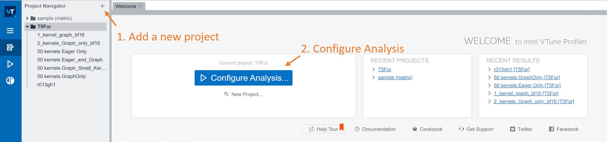
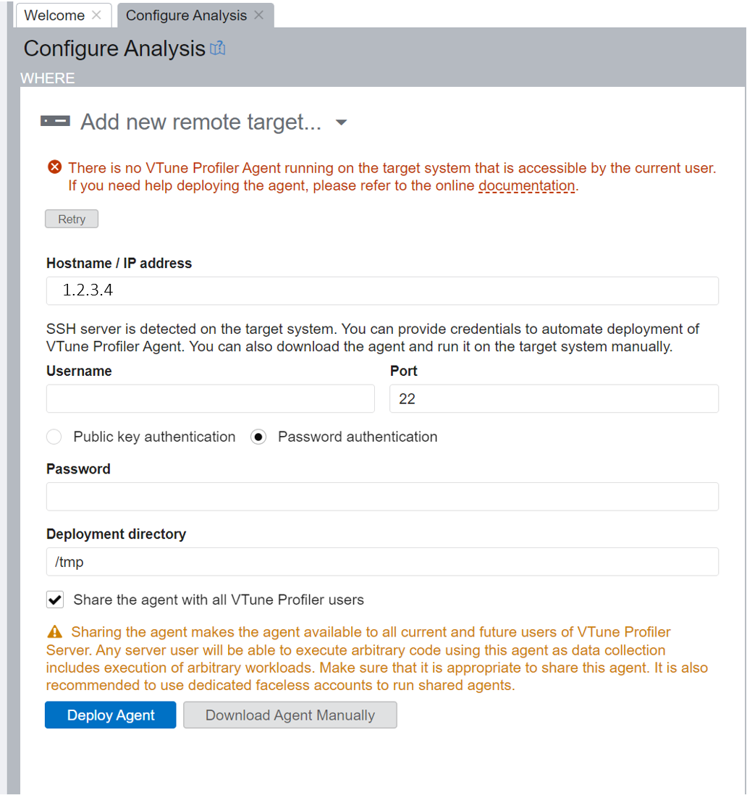
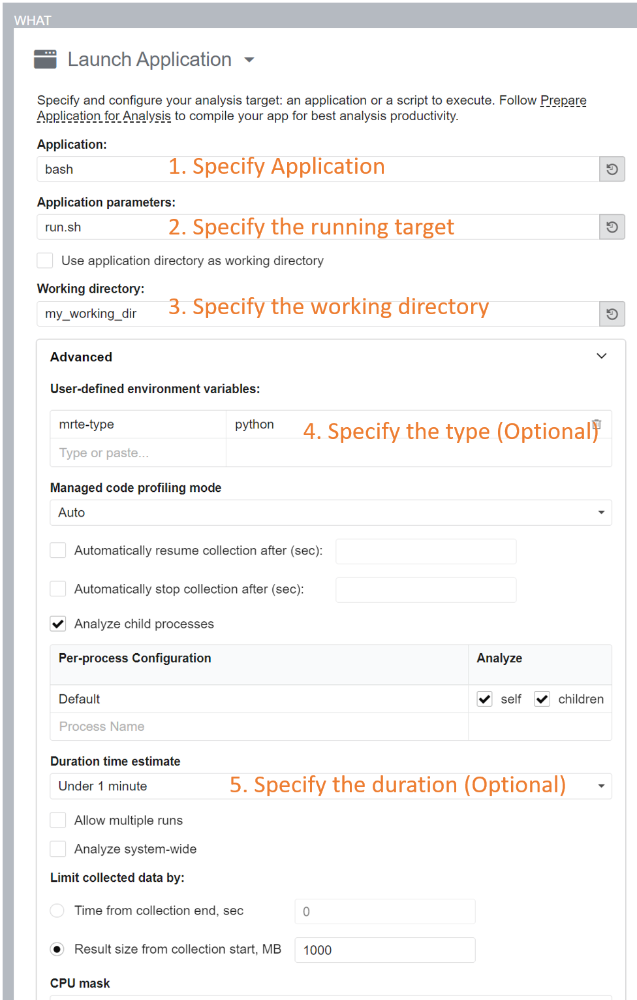
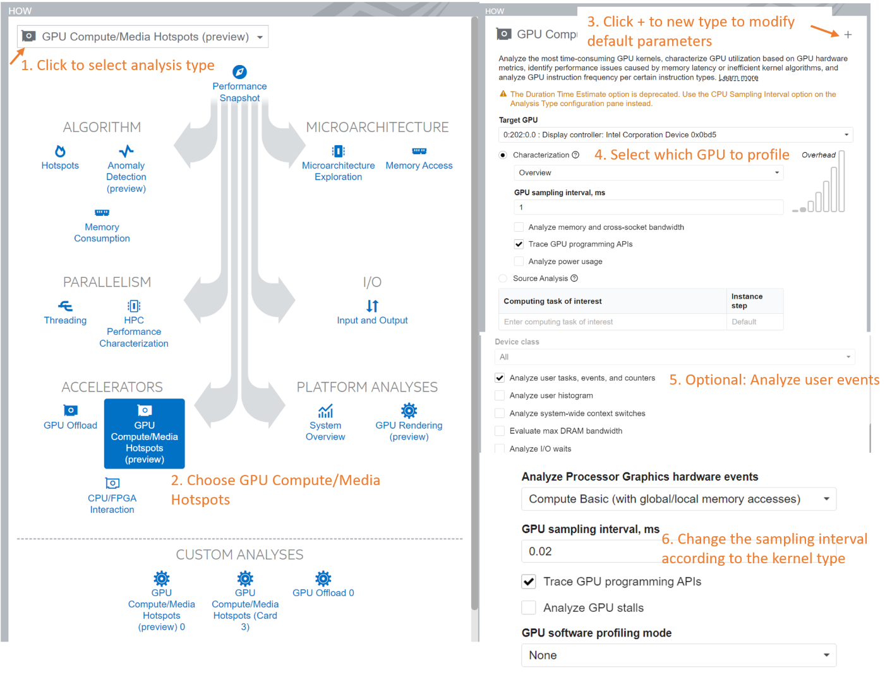
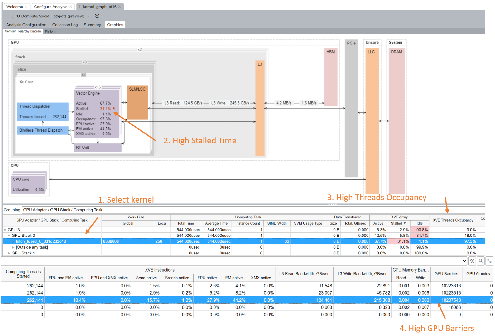
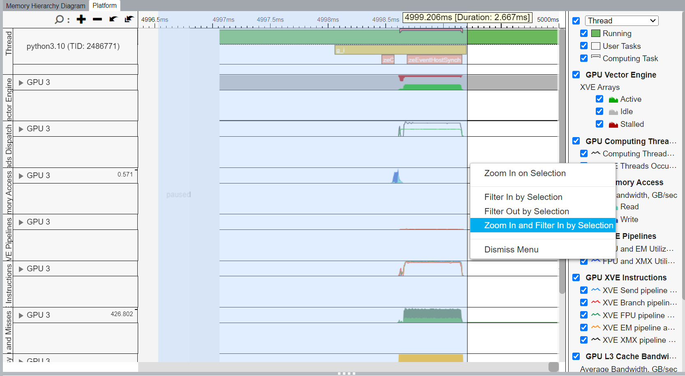

This recipe explains how to do kernel profiling using Intel® VTune™ Profiler. Normally, you use Intel® VTune™ Profiler for deeper understanding of kernel’s bottleneck and possible optimizing direction, while PyTorch profiler is used for the end-to-end model bottleneck.

- [Server Setup](#server-setup)
- [Profiler Configuration](#profiler-configuration)
  - [Configure Analysis](#configure-analysis)
    - [Where Setup](#where-setup)
    - [What Setup](#what-setup)
    - [How Setup](#how-setup)
    - [Controlling Profiler Range](#controlling-profiler-range)
    - [Start Profiling](#start-profiling)
- [Analyze Result](#analyze-result)
- [Additional Resources](#additional-resources)
- [Permission Check](#permission-check)


# Server Setup
The full install guide could be found in [Intel® VTune™ Profiler Installation Guide](https://www.intel.com/content/www/us/en/docs/vtune-profiler/installation-guide/2023-2/overview.html). If you are using a server, the whole installation and usage process will happen on the server, your local machine does not need anything. This recipe will use the [Web Server Interface](https://www.intel.com/content/www/us/en/docs/vtune-profiler/user-guide/2023-2/web-server-ui.html) for profiling.

You can start a web interface with the following command:

```Bash
# First source the necessary env
source  ~/intel/oneapi/vtune/latest/env/vars.sh
# (Recommended) Start the VTune Profiler Server if you wish to use this server for profiling
vtune-server --web-port=8080 --data-directory ./ --allow-remote-access --enable-server-profiling
# Start the VTune Profiler Server locally
vtune-backend --web-port 8080 --data-directory ./ --allow-remote-access
```

The above command enables the remote access with the port 8080. It will normally have the output like below:

```
VTune Profiler GUI is accessible via https://1.2.3.4:8080/
```

Optionally, you can add `--data-directory="my_dir"` to specify the data directory.

# Profiler Configuration



When entered in the web interface as is shown in the above figure, it is recommended to first create a new project for each kernel, and then configure analysis.

Normally, the Triton kernel will be compiled from the aten, with the following pattern:


```Python
# triton_kernel.py

# Module definition
class Repro(torch.nn.Module):
    def __init__(self):
        super().__init__()
    def forward(self, args):
        # ...
        result_tensor = ...
        return (result_tensor,)

# Case1: Compile with torch.compile
compiled = torch.compile(Repro().forward)
compiled(args)

# Case2: Compile generated with TORCH_COMPILE_DEBUG enabled
mod = make_fx(Repro(), tracing_mode='real')(args)
from torch._inductor.compile_fx import compile_fx_inner
compiled = compile_fx_inner(mod, args)
compiled(args)
```

The above Case 1 and Case 2 does not have much difference, they both will compile the module into Triton kernels. This recipe specifis on how to profile with the `compiled(args)` kernel call in the above.


## Configure Analysis

By clicking the above figure's `Configure Analysis` button, the first step is to deploy the VTune Profiler Agent.

### Where Setup



You could use the `where` tab to deploy the VTune Profiler to a remote server.
Enter the server ip address and username / password. Then by clicking the `Deploy Agent`, it will automatically deploy the agent. After the agent is setup, now the second column of `what` is available.

### What Setup


It is recommended to wrap Python script and environment settings in a `run.sh` file, and VTune will run the file using `bash run.sh`. An example of `run.sh` is like below:

```Bash
#! /bin/bash

# 1. Source necessary env variables
source ~/env_triton.sh
# 2. Set ZE_AFFINITY_MASK for multi-card GPU. The example shows to use the 2nd card.
# Note that the python should use your conda env's triton
ZE_AFFINITY_MASK=1 /home/user/miniconda3/envs/triton_env/bin/python triton_kernel.py
```
For the `what` setup, the *Application* should set as `bash` and *Application parameters* set as your script name (`run.sh`). The working directory also need to setup to the `triton_kernel.py`'s location.

In the above fiture, step 4 and step 5 are optional, please set with your need.


### How Setup



For GPU kernel profiling, it is recommended to select the analysis type as **GPU Compute/Media Hotspots**. After selection, the configuration is shown in the above figure.

By default, there are a few available selections, such as which GPU to profile on, and GPU sampling interval. If you don't need other settings, then using these selections would be enough. Note that the target GPU should match with the above `ZE_AFFINITY_MASK`'s GPU.

The grey options is only available with custom choice. Please follow the "step 3" in the above picture, to create a new custom type. Then you can modify the options like "analyze user tasks,events, and counters" in "step 5".

### Controlling Profiler Range
It is recommended to pause the profiler until the kernel code is actually running, so to reduce profiler size and generate more readable result.

For Python, one tool called [itt-python](https://github.com/NERSC/itt-python) could help to mark the start/end of the interest code. The usage is as follows:


```Python
# ... uninterested code
import itt

# warmup iters.
for i in range(50):
    compiled(args)
    torch.xpu.synchronize()

# Start Profiling
itt.resume()
compiled(args)

torch.xpu.synchronize()
# Fully detach all the collectors when done
itt.detach()

# ... uninterested code
```

### Start Profiling


On the bottom of the web interface, there are two buttons, it is highly recommended to **Start Paused**.

Directly click on Start also works, but the resulting data would be large and noisy. By using the **Start Paused**, the collector will not collect data until be triggered by the `itt.resume()` in the above call.

Sometimes, the VTune doesn't allow to run due to the missing requirements. One could refer to [Permission Check](#permission-check) for detail.

# Analyze Result

After the result is collected, there are various of infos could be explored. Here is one example of identifying the optimizing direction for a kernel:



For example, when clicked on **Graphics=>Memory Hierarchy Diagram**, there are several overview for the kernel.

By first selecting the kernel, the figure will be automatically updated and several intuitions could be made.

For example, in the above figure, Point 3 indicates that this kernel has high XVE threads occpancy, this is good for a kernel. Indicating that this kernel occupies the XPU's capacity.

However, there is one red field indicating Point 2, that the stalled time is high. By checking the Point 4, the GPU Barrier is high. Then there may have some instructions like synching that would make the XPU idle. With this in mind, then could double click the kernel and check with the assembly code.

One could also find interesting point with **Graphis=>Platform** tab as is shown below. This one is much similar with chrome tracing but with richer information. One tip is to *Zoom In and Filter in by Selection* for interesting kernel, and then find possible optimizing field.



# Additional Resources
- [Profiling Machine Learning Applications](https://www.intel.com/content/www/us/en/docs/vtune-profiler/cookbook/2023-2/profiling-machine-learning-applications.html): This documents could help for more detailed on profiling on Machine Learning projects.

# Permission Check
In some machines, the Intel® VTune™ Profiler requires additional settings for the functionality. You could run the check by using following tools:

```Bash
bash ~/intel/oneapi/vtune/latest/bin64/vtune-self-checker.sh
```

It will output the required settings. For example, it may has the following errors:

```LOG
HW event-based analysis (counting mode)
Example of analysis types: Performance Snapshot
    Collection: Ok
    Finalization: Ok...
    Report: Ok

Instrumentation based analysis check
Example of analysis types: Hotspots and Threading with user-mode sampling
    Collection: Fail
vtune: Error: Cannot start data collection because the scope of ptrace system call is limited. To enable profiling, please set /proc/sys/kernel/yama/ptrace_scope to 0. To make this change permanent, set kernel.yama.ptrace_scope to 0 in /etc/sysctl.d/10-ptrace.conf and reboot the machine.
vtune: Warning: Microarchitecture performance insights will not be available. Make sure the sampling driver is installed and enabled on your system.

HW event-based analysis check
Example of analysis types: Hotspots with HW event-based sampling, HPC Performance Characterization, etc.
    Collection: Fail
vtune: Error: This analysis requires one of these actions: a) Install Intel Sampling Drivers. b) Configure driverless collection with Perf system-wide profiling. To enable Perf system-wide profiling, set /proc/sys/kernel/perf_event_paranoid to 1 or set up Perf tool capabilities.
vtune: Warning: Access to /proc/kallsyms file is limited. Consider changing /proc/sys/kernel/kptr_restrict to 0 to enable resolution of OS kernel and kernel module symbols.
```

For example, the above suggests to set the `ptrace_scope` to 0 and `perf_envent_paranoid` to 1. One could do by

```Bash
echo "0" | sudo tee /proc/sys/kernel/yama/ptrace_scope
sudo sh -c 'echo 1 >/proc/sys/kernel/perf_event_paranoid'
```
Note that it is not necessary to enable all if you don't have enough permission. Just set them according to your need.
